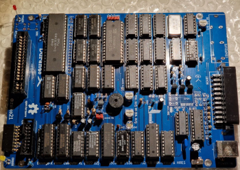

# Durango

<figure markdown>

<figcaption>Durango Computer</figcaption>
</figure>

Originally born as a 6502 tester without any specific chips, soon became a full-featured home computer with integrated video output
Range

* **Durango PROTO**: the original CPU tester with some basic I/O (1 MHz)
* **Durango·SV**: 16-colour video output module for SVGA monitor (abandoned)
* **Durango·S**: 128x128, [16-colour](palette.md) home computer
* **Durango·R**: as above but with 256x256 monochrome display
* **Durango·X**: full model, with both the ·S and ·R models video output _(software switchable)_

## Basic Specs

* **CPU**: 65C02 @ 1.536 MHz
* **ROM**: up to 32 KiB cartridge slot (more with bank switching)
* **RAM**: 32 KiB
* **Expansion connector**: [parallel 8-bit bus with 16 addresses](exp_bus.md) for keyboards, joysticks etc.
* **Video output**: via CCIR (PAL) TV thru RGB SCART connector
    Also available as options: composite video (greyscale/HIRES only), Sync-on-Green and Component Video outputs

## Video Modes

* 128 x 128 px. 4 bpp ([16-colour GRgB fixed palette](palette.md), no restrictions) except in ·R model
* 256 x 256 px. 1 bpp (monochrome) except in ·S model
* Switchable greyscale mode (16 levels) except in ·R model
* Inverse Video mode (hardware)
* Four 8 KiB screens software-switchable (screen 0 is shared with ZP, stack etc)

## Options

The _Durango project_ allows to build your computer under **several configuration options, _all of them using the same PCB_**, by just choosing the appropriate components.

### Supported video mode options

* Durango-S: _colour mode only_ (128 x 128 px., 4 bpp)
* Durango-R: _HIRES mode only_ (256 x 256 px., 1 bpp)
* **Durango-X**: _both modes available_ **(recommended option)**

### Video output options

* **RGB-SCART (recommended option)**: will display colour _on RGB mode only_, as composite output needs the PAL encoder.
* Sync-on-green: suitable for some monitors, especially the **Sony PVM range**, via RCA connectors. _Note that greyscale mode is not available_.

!!! note

	Future revisions of the _Durango-X_ board will replace the _Sync-on-green_ option by a **Component video** output, which is both suitable for the _PVM monitors_ and more **modern TV sets**, lacking SCART socket.

### PAL encoder option

* with PAL encoder (AD724): _composite output_ may be in colour.
* **No PAL encoder (recommended option)**: composite output is _greyscale_.

!!! warning

	The **PAL encoder** option was an afterthought, thus _picture quality may be poor_ or, on some devices, may not display any colour at all.
	
	In general, as the _Durango_ computer provides a **slightly non-standard video signal**, some displays _might be incompatible_ (although this is quite rare according to our experience so far).

### Second composite output option

This adds an RCA jack (together with a couple more for _audio_) with **composite video** output, although it will be _**grayscale** unless the PAL encoder option is installed_. If both this output and the one on the SCART are to be used _at the same time_, you may wish to swap `R15` for a lower value (say, 180 ohm) for picture stability.

Note that the _Sync-on-green_ option, unlike the SCART, does NOT provide audio output, thus the _3 RCA jack set_ may be desired for audio, even if the second video output isn't functional.
