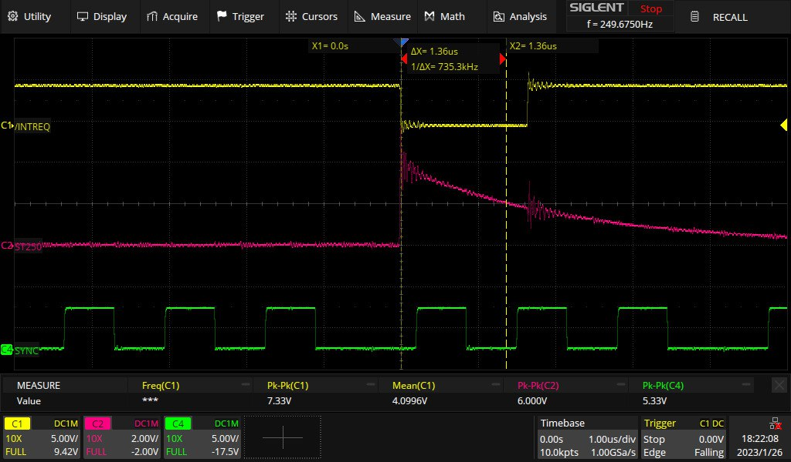

# Durango-X IRQ generation

## Caveats

Unlike most computers, where some _dedicated peripheral chip_ works as an **interrupt controller**, _latching_ the interrupt request
until _acknowledged_ by the CPU's ISR (Interrupt Service Routine), **Durango-X** uses a simple counter (**U14**, 74HC4040) plus a few
_Schmitt-trigger_ gates for the generation of a brief pulse (around **10 µs**) for the IRQ input, as long as it's not disabled via
the _Interrupt Enable Port_ at `$DFAx`. Thus, no _acknowledge_ is possible or necessary.

Since the IRQ pulse is not latched, there is an increased risk of losing interrupts whenever some _critical code_ is executed with
interrupts _masked_ (via the `SEI` opcode), as other systems will service the pending request as soon as the interrupt mask is cleared.
This, however, shouldn't be a concern, as _longer_ critical code may anyway lose some interrupts even in other computers, as they
usually won't _queue_ IRQs.

The real issue, though, is the **length** of the IRQ pulse, as it's generated in an **analogue** way thru an RC-network and a
Schmitt-trigger gate. Several factors, including component tolerances, may affect actual lenght which, by the way, is by no means
_constant_. The nominal value, **10 µs** (about 15 _clock cycles_) is both long enough for _reliable IRQ triggering_,
and short enough not to be a problem with _succint ISRs_ -- whose _overhead_ is at least **7+6 cycles** for the trigger sequence plus
the mandatory `RTI` at the end, adding on top of that whatever time takes to finish the current instruction.

There is definitely quite a bit of **tolerance** on the IRQ pulse length, although some _extreme_ cases could be troublesome.

### Long interrupt pulses

Unless you're dealing with a _really short_ ISR, the IRQ pulse can be **way** longer than the specified value without too much trouble.
_Note that the [Durango-X Hardware test](../software/fulltest.md) uses a minimal ISR for testing, thus might **fail** the test
without any other apparent issues._
In **extreme** cases, though, the IRQ pulse may last _longer_ than the ISR itself, thus **triggering a second time** at once. Again, this is hardly
an issue, save for any interrupt-based timing being thrown off.

If you suspect about this, and are able to run [EhBASIC](../software/ehbasic.md), you may `RUN` the following code to check the _interrupt timing_:

```
1 PRINT DEEK($206)/250:GOTO 1
```

Which should print the _system time_  scrolling **in seconds**, in a remarkably accurate fashion. A **long interrupt pulse**
would make the count **faster**!

In order to _shorten the IRQ pulse_, the value of `R26` (nominally **100 K**) and/or `C8` (**68 pF**) should be _reduced_ -- usually the former is preferred, as a second resistor _in parallel_ with `R26` will do.
_Note that the use of a 74HC**T**132 for `U8` (instead of the recommended **HC**) will effectively **stretch** the pulse to about **twice** its length_.

<figure markdown>

<figcaption>IRQ pulse with HCT and 100 Kohm, actual length is 11.2 µs as indicated by the cursors; the displayed pulse is stretched by probing the RC network</figcaption>
</figure>

### Short interrupt pulses

On the other hand, this is more likely to cause problems. Unlike the _NMI_, the 6502 samples the **IRQ** line _after_ the end of each instruction;
some opcodes may take **up to 7 clock cycles or ~4.6 µs** -- anything _shorter_ during the execution of such instructions might be **missed**.
_Surprisingly, the current  version of **Hardware test** code runs pretty short opcodes, thus being quite tolerant about this_.

<figure markdown>

<figcaption>IRQ pulse with HC and 22 Kohm; again actual length is 1.36 µs as indicated by the cursors, which is way too short</figcaption>
</figure>

As mentioned, losing interrupts frequently might have the effect of **impairing (or completely _disabling_) the keyboard/gamepad response**,
besides any timing alterations. Once again, running the EhBASIC code above (if you're able to type it!) will confirm this -- too short of a pulse
will make the second count **slower**.

Similarly, the _opposite_ remedies are suitable in this case: _augmenting_ the value of `R26` and/or `C8` (you may place another capacitor
_in parallel_ for that matter).

<figure markdown>

<figcaption>IRQ pulse with HC and 39 Kohm; this 2.36 µs pulse is definitely on the short side, but is less likely to cause trouble. </figcaption>
</figure>
