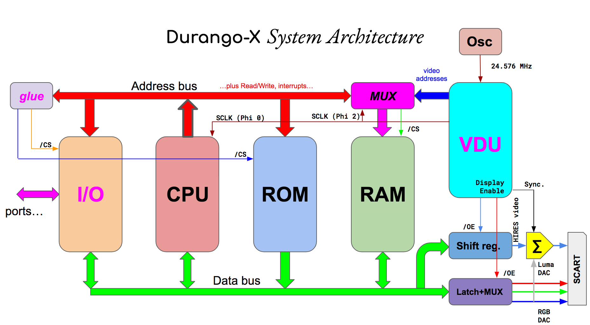

# Theory of Operation

This document explains the way **Durango-X** is designed. Since one of its goals is the use of _standard 74xx logic circuits_, the [schematic]([https://](https://github.com/zuiko21/minimOS/tree/master/hard/kicad/durango/full)) may appear pretty complex at first sight, but it's easily understood with the help of this guide.

This is also a good complement to the [Troubleshooting guide](../troubleshoot.md).

## Block Diagram

Unlike many Single Board retro-Computers, **Durango-X**'s main feature is the **_built-in_ video output**. This is achieved by _multiplexing_ the RAM's address bus between the CPU and the video address generation circuit, for **optimum performance** -- no _wait states_ nor _snow_ during screen accesses!

Here's a _simplified_ **Block Diagram** showing Durango-X's major blocks and most of its interconnections:
<figure markdown>

<figcaption>_Simplified_ Block Diagram of the Durango-X computer</figcaption>
</figure>

## Circuit description

According to a _modular approach_ as suggested by [EmilioLB](http://emiliollbb.net/), several big blocks can be isolated:

* **Clocks:** generation of both _video_ and _CPU_ clock signals, as they're **fully synchronised** for optimum performance.
* **VDU:** picks video data from SRAM and sends it to the monitor thru some analogue circuitry
