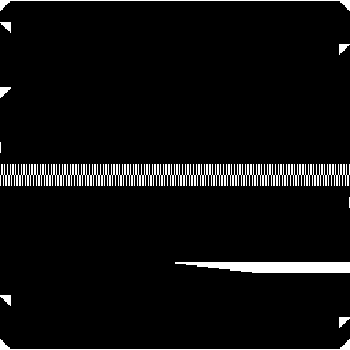

# Full Test

The **Full Test ROM** contains some useful tests to check that your Durango is working properly. Here you can find information about each test.

First of all, you need to know that you can switch between tests using the **NMI button** of your Durango, or `F2` if you are running on Perdita Emulator.

!!! note

	_Rev. 1_ of the Durango-X board has **no debouncing** on the NMI button. Depending on your particular tactile switch, hitting NMI may skip some tests. _This will be addressed on the next Durango revision_, and will never be an issue under emulation.

## Durango Test

<figure markdown>

<figcaption>Durango test With Legend</figcaption>
</figure>

The first test checks that the built-in features of the Durango board are working. This test checks the following features:
* Zeropage test: exhaustive test of this **essential** memory area. A brief high-pitched _chirp_ is heard.
* Address lines and mirroring test: looks for _shorts_ on the CPU and/or MUX address lines. Hardly noticeable.
* RAM test: The whole 32 K is tested, which takes about one second. A moving pattern of vertical white bars can be seen on the screen.
* ROM test: the ROM _checksum_ is verified and the **Durango-X logo** is shown if passed; otherwise, `ROM` in the middle of a flashing screen will show up.
* Line and Frame Blanking test: checks that these signals can be read by the CPU at `$DF88`. If everything is OK, you will see the letters `L F` in green on the top left corner. If _vertical_ blanking is not reported, the `F` will show up in **red**; _orange_ letters mean timing is way off, or even the _horizontal_ blanking is not reported (usually much less of an issue). _Some flashing on the screen may be noticed during this test_.
* Video mode port: Out of 8 bits, **only 6** are actually _functional_; and just **the upper 4 are _needed_ to be readable**. The colour of each bit is coded as follows:
		-	GREEN: **required** _and_ readable (the 4 leftmost dots MUST be green)
		- CYAN: readable but not required (some _mods_ may allow this to happen)
		- MAGENTA: **not required** and neither readable (usually the 4 rightmost dots, repeated below for convenience)
		- RED: _required_ but **not readable**. _This is a malfunction in any case_ and will show up repeated below.
* NMI test: After the `NMI` text appears, you have about _2 seconds_ to press the NMI button as many times as you like (a _faint click_ will be heard every time), then a dot for every _detected_ hit will be displayed. _Without button **debouncing**, more dots than the number of hits will appear_, but this is normal. _Less dots than the number of hits is a malfunction_.
* Interrupt test: This test counts the number of interrupts in a time period (~129 ms); the screen will flash while doing it. If the number of interrupts differs from the expected one (**32**) _give or take one_, the test fails. Please check [troubleshoot](../troubleshoot.md) section for more information.
* 6502 model shows the exact variant of the 6502 CPU:
	- `6502`: _Classic **NMOS** 6502 is **not** oficially supported, thus shown in **red**_.
	- `65C02`: original CMOS **65C02** (No `SMB/RMB/BBS/BBR` opcodes).
	- `R'C02`: 65C02 with Rockwell/WDC extensions (`SMB/RMB/BBS/BBR`).
	- `65816` (in pink): **65C802/65C816**, but the latter will need a suitable _adapter_.
* Full Test Result: If ALL the tests have passed, after a _sweeping sound_ you can see an `OK` text in green.

### Error codes

If any of the above tests fails, the `ERROR` LED will blink, while the screen will flash in sync. The pattern of flashes indicate the failed test.

| Test | flashing pattern |
|------|------------------|
|Zeropage|`@........`|
|Address lines|`@.@......`|
|RAM|`@.@.@....`|
|ROM checksum|`@.@.@@@@@`|
|VSYNC blanking|`@..@@@@@@`|
|HSYNC blanking|`@.@@.@@.@`|
|IRQ (slow)|`@@@@.....`|
|IRQ (fast)|`@.@.@.@..`|

Where `@` means LED _on_ and `.` means LED _off_. Each state lasts ~0.3 seconds, for a total **~2.7 s. cycle**.

## GamePad Test

<figure markdown>

<figcaption>Durango Gamepad Test</figcaption>
</figure>

With this test, You can see if all the buttons are working properly on your gamepad. Each time you press a gamepad button, you can see the red dot on screen.

## KeyBoard Test

<figure markdown>

<figcaption>Durango Keyboard Test</figcaption>
</figure>

With this test, you can see if all the keys of your keyboard are working properly. Each time you press a key, you can see the corresponding dot on screen changing its colour from cyan to red.

## Colour Test Chart

<figure markdown>

<figcaption>Durango Colour Test Chart</figcaption>
</figure>

This test is intended for proper adjustment of `RV127` and `RV128` on Durango-X's main board. All colours are shown as a reference.
_See [Video Output calibration](vdu_calib.md) for details_.

## High Resolution Test Chart

<figure markdown>

<figcaption>Durango High Resolution Test Chart</figcaption>
</figure>

This test is intended for proper adjustment of `RV231` on Durango-X's main board, only affecting _HIRES_ mode.
_See [Video Output calibration](vdu_calib.md) for details_.
