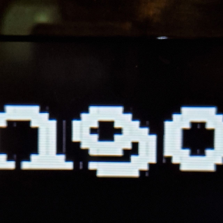

# Video Output Calibration

The _Video Circuitry_ of the **Durango-X** home computer has _very tight_ timing. Thus, some **adjustment** is needed in order to cope with _component tolerances_, by means of a few **variable resistors** which, in turn, generate _slight_ delays for some critical signals, in an attempt to match their timing.

!!! note

	Admittedly, the Durango-X design is _far from perfect_... adding performance differences according to the source of components, **no perfect picture is guaranteed**, no matter the adjustment procedure executed. Most of the times you'll be able to reach a _reasonable compromise_, though.

## Colour mode

Two _adjustable resistors_ are provided for this video mode: **RV127** (`PIXEL DELAY`) and **RV128** (``ENABLE DELAY``). _These adjustments may interact with each other_, thus make sure to **recheck** them a few times for the best possible picture quality.

### PIXEL DELAY

<figure markdown>

<figcaption>Close-up of wrong PIXEL DELAY setting</figcaption>
</figure>

**This is the most important setting** with the most noticeable effect in picture quality. Since the multiplexer **U125** (74HC157) has _slightly shorter propagation delay_ than the latch **U124** (74HC574), a thin **ghost image** of every _even pixel_ will show up to the right of _odd pixels_. Thus, a suitable _delay_ between switching of their inputs will compensate for this; however, too much of it may lead into _uneven_ pixels.

<figure markdown>

<figcaption>Too little: turn _counterclockwise_</figcaption>
</figure>
<figure markdown>

<figcaption>**OK**</figcaption>
</figure>
<figure markdown>

<figcaption>Too much: turn _clockwise_</figcaption>
</figure>

### ENABLE DELAY

Since the video address counters keep supplying valid addresses all the time, video output **must be disabled** after the whole 128px (64 bytes in colour mode) or 256px (32 bytes in HIRES) have been displayed for every line, in order _not to disturb the sync_ signal. The same goes true for the _vertical blanking interval_. Propagation delays may have the effect of **repeating the leftmost pixel** of every raster as a thin _ghost_ line **after the rightmost pixel**. This can be mitigated by adding a _slight_ delay to the **Display Enable** signal; in case of _colour mode_, this takes `/CDE` line from **U22 pin 6** (74HC175) thru a variable resistor `RV128` -- this, combined with the **U127 pin 19** (74HC245) _input capacitance_, creates the needed delay.

However, _these timing differences are NOT symmetrical_, thus in practice the **enable-off** as described may need a _different_ setting than the **enable-on** moment to the left of the picture; the latter one will actually sample the _display RAM_ contents **just before the horizontal counter is reset**, thus some pixel _around the centre_ of the screen (from the 33rd byte of the previous raster) shows up at the left of the picture. _This is usually a **more noticeable** deffect than the previous one_, thus if no satisfactory compromise can be set, it's normally best to leave this setting in the _low_ side.

<figure markdown>

<figcaption>Too little: turn _counterclockwise_</figcaption>
</figure>
<figure markdown>

<figcaption>**OK**</figcaption>
</figure>
<figure markdown>

<figcaption>Too much: turn _clockwise_</figcaption>
</figure>

### HIRES DELAY

**This is the only adjustment available in _HIRES_ mode**, and it's equivalent to the aforementioned `ENABLE DELAY` for colour. The attempt is to **minimise stray pixels** to the left and right sides of the picture, although most of the times it must be a _compromise_ setting.

Technically speaking, this puts some delay **on the video stream itself**, thus too much of a setting _may impair picture sharpness_ or, most likely_, create some gliches.

<figure markdown>

<figcaption>Too little: turn _counterclockwise_</figcaption>
</figure>
<figure markdown>

<figcaption>**OK**</figcaption>
</figure>
<figure markdown>

<figcaption>Too much: turn _clockwise_</figcaption>
</figure>
